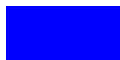

# Getting Started with SVGs  

Before diving into creating SVGs, let's set up the tools you need and understand the basic structure of an SVG file. By the end of this section, you'll be ready to create your first SVG!  

---

## Tools You Need

### 1. Code Editor
To create and edit SVGs, you'll need a text editor or code editor. Here are some options:  

- Visual Studio Code (recommended)  
- Sublime Text  
- Atom  
- Even a basic editor like Notepad will work for simple examples.  

### 2. Optional Design Tools 
For complex SVGs, you might use a graphic design software like:  
- Inkscape (Free and open-source)  
- Adobe Illustrator  
- Figma  

---

## Basic Scructure of an SVG File  

An SVG file is written in XML format, which means it's a tree structure with elements and attributes.  

Here's a simple example:  
```xml
<svg xmlns="http://www.w3.org/2000/svg" width="200" height="100">
  <rect x="10" y="10" width="200" height="100" fill="blue" />
</svg>
```


### Explanation of the Code:  

1. **`<svg>` Tag**  
The root element that defines the SVG canvas.  
    - `xmlns` specifies the XML namespace. Always include this.  
    - `width` and `height` define the canvas size.  
2. **`<rect>` Tag**  
Defines a rectangle shape.
    - `x` and `y`: Starting position of the rectangle.
    - `width` and `height`: Size of the rectangle.
    - `fill`: Color of the rectangle.

---

## Next Steps

Learn how to view your SVGs in different environments in the next section.  
**[Next: Viewing SVGs](./3viewing-svg.md)**.

- Or revisit the **[Introduction](./1introduction.md)**.  
- Or return to the **[Home Page](./README.md)**.  
