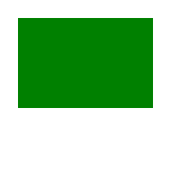
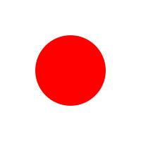
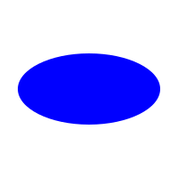
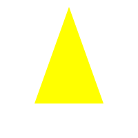
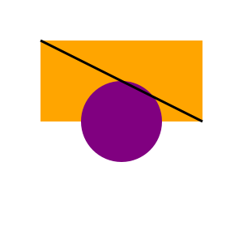

## Creating Shapes

In this section, we'll learn how to create different shapes in SVG. By the end of this page, you'll be able to create basic geometric shapes, such as rectangles, circles, and polygons.

---

## 1. Rectangles

Rectangles are one of the most common shapes in SVGs. Here's how to create a simple rectangle:

```xml
<svg xmlns="http://www.w3.org/2000/svg" width="200" height="200">
  <rect x="20" y="20" width="150" height="100" fill="green" />
</svg>
```



### Explanation:

- `<rect>`: Defines a rectangle.
- `x` and `y`: The starting coordinates (top-left corner) of the rectangle.
- `width` and `height`: Define the size of the rectangle.
- `fill`: The color to fill the rectangle.

---

## 2. Circles

Circles are created with the `<circle>` element. Here's an example:

```xml
<svg xmlns="http://www.w3.org/2000/svg" width="200" height="200">
  <circle cx="100" cy="100" r="50" fill="red" />
</svg>
```



### Explanation:

- `<circle>`: Defines a circle/
- `cx` and `cy`: The center coordinates of the circle.
- `r`: The radius of the circle.
- `fill`: The color to fill the circle.

---

## 3. Ellipses

An ellipse is like a stretched circle. It's defined with the `<ellipse>` element:

```xml
<svg xmlns="http://www.w3.org/2000/svg" width="200" height="200">
  <ellipse cx="100" cy="100" rx="80" ry="40" fill="blue" />
</svg>
```



### Explanation:

- `<ellipse>`: Defines a circle/
- `cx` and `cy`: The center coordinates of the ellipse.
- `rx` and `ry`: The horizontal and vertical radii, respectively.
- `fill`: The color to fill the ellipse.

---

## 4. Lines

You can create straight lines with the `<line>` element. Here's an example:

```xml
<svg xmlns="http://www.w3.org/2000/svg" width="200" height="200">
  <line x1="10" y1="10" x2="190" y2="190" stroke="black" stroke-width="2" />
</svg>
```


### Explanation:

- `<line>`: Defines a line.
- `x1` and `y1`: The starting point of the line.
- `x2` and `y2`: The ending point of the line.
- `stroke`: The color of the line.
- `stroke-width`: The width of the line.

---

## 5. Polygons

A polygon is a shape with multiple straight sides. You define it with the `<polygon>` element, and the points are specified in a list:  

```xml
<svg xmlns="http://www.w3.org/2000/svg" width="200" height="200">
  <polygon points="100,10 150,150 50,150" fill="yellow" />
</svg>
```



### Explanation:
- `<polygon>`: Defines a polygon.
- `points`: A list of coordinates (x, y pairs) that form the vertices of the polygon. For this triangle, the points are (100,10), (150,150), and (50,150).
- `fill`: The color to fill the polygon.  

---

## 6. Lines and Shapes Together

You can combine multiple shapes and lines in one SVG. Here's an example that combines a circle, rectangle, and a line:  

```xml
<svg xmlns="http://www.w3.org/2000/svg" width="300" height="300">
  <rect x="50" y="50" width="200" height="100" fill="orange" />
  <circle cx="150" cy="150" r="50" fill="purple" />
  <line x1="50" y1="50" x2="250" y2="150" stroke="black" stroke-width="3" />
</svg>
```



### Explanation:  
- The SVG contains a rectangle, a circle, and a line that intersect.
- You can adjust the `x`, `y`, `width`, `height`, `fill`, and other attributes for each shape.

---

## **Next Steps**

Now that you've learned how to create more basic shapes, you can move on to adding colors, gradients, and text in your SVGs!  
**[Next: Text and Colors](./5text-and-colors.md)**.

- Or revisit the **[Viewing SVGs Guide](./3viewing-svg.md)**.
- Or return to the **[Home Page](./README.md)**.
