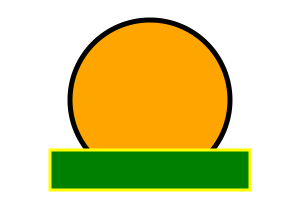

## Adding Text and Colors to SVGs

In this section, we will learn how to add text and color to your SVGs, making them more visually appealing and informative.  

---

## 1. Adding Text

You can add text to your SVG using the `<text>` element. Here's an example:  

```xml
<svg xmlns="http://www.w3.org/2000/svg" width="300" height="200">
  <text x="50" y="50" font-family="Arial" font-size="24" fill="black">Hello, SVG!</text>
</svg>
```


### Explanation:  
- `<text>`: Defines the text in SVG.
- `x` and `y`: The starting point (coordinates) of the text.
- `font-family`: The font style.
- `font-size`: The size of the text.
- `fill`: The color of the text.

You can also add additional properties like `text-anchor` to control the text alignment, and `stroke` for a text outline.  

---

## 2. Adding Colors

There are multiple ways to add color to your SVG elements:  
- **Fill**: Colors the interior of a shape.
- **Stroke**: Colors the outline of a shape. 

Here's how you can apply them:  

```xml
<svg xmlns="http://www.w3.org/2000/svg" width="300" height="200">
  <circle cx="150" cy="100" r="80" fill="orange" stroke="black" stroke-width="5" />
  <rect x="50" y="150" width="200" height="40" fill="green" stroke="yellow" stroke-width="3" />
</svg>
```



### Explanation: 
- `fill`: Sets the fill color of a shape.
- `stroke`: Sets the stroke (border) of a shape.
- `stroke-width`: Controls the thickness of the stroke.

---

## 3. Using Gradients

You can create more dynamic colors with gradients. Here's an example of a linear gradient: 

```xml
<svg xmlns="http://www.w3.org/2000/svg" width="300" height="200">
  <defs>
    <linearGradient id="grad1" x1="0%" y1="0%" x2="100%" y2="100%">
      <stop offset="0%" style="stop-color:rgb(255,255,0);stop-opacity:1" />
      <stop offset="100%" style="stop-color:rgb(255,0,0);stop-opacity:1" />
    </linearGradient>
  </defs>
  <rect x="50" y="50" width="200" height="100" fill="url(#grad1)" />
</svg>
```


### Explanation:  
- `<defs>`: Defines a reusable element like gradients.
- `<linearGradient>`: Defines a linear gradient.
  - `id`: The unique identifier for the gradient.
  - `x1`, `y1`, `x2`, `y2`: Define the direction of the gradient.
- `<stop>`: Defines color stops within the gradient.

---

## **Next Steps**

Now that you know how to add text and color to your SVGs, it's time to animate them!  
**[Next: Animating SVGs](./6animating-svgs.md)**.  

- Or revisit the **[Creating Shapes Guide](./4creating-shapes.md)**.  
- Or return to the **[Home Page](./README.md)**.  