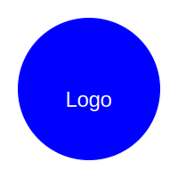

## Example Projects with SVGs

In this section, we'll explote some example projects using SVGs. These projects will help you see how SVGs can be used in practical applications.  

---

## **1. Creating a Simple Logo**

Let’s create a simple logo using SVG. Here's a basic example of a circular logo with text:  

```xml
<svg xmlns="http://www.w3.org/2000/svg" width="200" height="200">
  <circle cx="100" cy="100" r="80" fill="blue" />
  <text x="100" y="120" font-family="Arial" font-size="24" fill="white" text-anchor="middle">Logo</text>
</svg>
```



### Explanation:  
- A blue circle with the word "Logo" in white text in the center  

---

## 2. Creating an Interactive Infographic

You can make interactive infographics by adding interactivity with JavaScript. Here's an example of an interactive SVG element that changes color when hovered:  

```xml
<svg xmlns="http://www.w3.org/2000/svg" width="300" height="200">
  <circle cx="100" cy="100" r="50" fill="green"
    onmouseover="this.setAttribute('fill', 'red')"
    onmouseout="this.setAttribute('fill', 'green')" />
</svg>
```

Github does not allow SVGs to execute JavaScript for several reasons.  
Do this one on your own or check out the example on [JSFiddle](https://jsfiddle.net/ynshbd8p/1/).

### Explanation:
- The circle changes color when you hover over it using inline JavaScript events.  

---

## **Next Steps**

Congratulations! You’ve now seen how to create, style, and animate SVGs. Keep experimenting with new ideas and techniques!   

- **[Revisit Animating SVGs Guide](./6animating-svgs.md)**.  
- **[Back to the Home Page](./README.md)**.  
